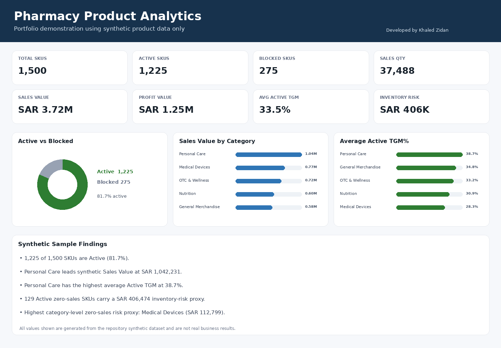

# Pharmacy Product Analytics Portfolio

A recruiter-ready **Data Analyst / Business Analyst** portfolio project demonstrating an end-to-end product-performance workflow across CSV/Python validation, SQL Server, Power BI design, and a browser-based HTML dashboard.

> **Public-data notice:** every row in this repository is synthetic. No proprietary business dataset, customer/patient/employee information, prescription information, credentials, internal endpoints, or production identifiers are included.

## Featured Portfolio

**Khaled Zidan — Healthcare & Business Data Analytics**

[Saudi Healthcare Analytics](https://github.com/khaledzidan203-stack/saudi-healthcare-analytics) ·
[Hospital360](https://github.com/khaledzidan203-stack/Hospital360) ·
[Online Retail Growth & Customer Intelligence](https://github.com/khaledzidan203-stack/online-retail-growth-customer-intelligence) ·
[Pharmacy Category Management](https://github.com/khaledzidan203-stack/pharmacy-category-management) ·
[Regional Sales Performance](https://github.com/khaledzidan203-stack/regional-sales-analytics-portfolio)

**Core stack:** Power BI · SQL · Python · DAX · Analytics Engineering · Healthcare / Pharmacy / Retail Analytics

## Executive summary
This project models a common retail-pharmacy analytics problem: understand assortment status, category performance, gross margin, zero-sales inventory exposure, product leaders, and supplier dependency from a clean product-level dataset. A single public Clean Master Dataset feeds multiple analytical implementations so results can be cross-validated.

## Business problem
Product and category teams need to distinguish healthy assortment from non-moving stock, identify high-performing SKUs, understand category-level margin quality, and detect supplier concentration that could create continuity risk.

## Project objectives
- Build a reproducible Clean Master Dataset suitable for multiple analytical tools.
- Measure SKU status, sales, profit, TGM%, zero-sales risk, and supplier concentration.
- Produce reusable SQL views and ranking queries.
- Define a five-page Power BI report design and DAX measure layer.
- Provide a working HTML dashboard for recruiters to run locally or host on GitHub Pages.
- Demonstrate cross-tool validation and public-data governance.

## Dataset description
`data/sample_pharmacy_products.csv` contains **1,500 synthetic SKU rows** across five generic pharmacy-retail categories. The grain is one SKU per row. The dataset includes Status, Category, Sub-Category, Supplier, RSP, TGM%, Sales Quantity, Stock on Hand, Sales/Profit values, and derived zero-sales/risk fields.

See `data/data_dictionary.csv` and `docs/data_model.md`.

## Tools and technologies
- **Excel / Power Query:** a downloadable synthetic analysis workbook with formula-driven Clean Data, KPI, category/TGM, zero-sales, Top 20, supplier, findings, dashboard, and process sheets.
- **SQL Server:** database table, data-quality checks, Views, window functions, Top-N ranking.
- **Power BI:** Power Query M reference, DAX measures, report-page specification, theme JSON.
- **HTML / CSS / JavaScript:** interactive filterable dashboard with no framework dependency.
- **Python:** reproducible example-output calculation and repository validation using the standard library.
- **GitHub Actions:** automated validation workflow.

## Data preparation
The public model applies generalized rules rather than copying proprietary source logic:
1. standardize status to `Active` / `Blocked`;
2. validate one row per SKU;
3. derive `Sales_Value = RSP × Sales_Qty`;
4. derive `Profit_Value = Sales_Value × TGM_Pct`;
5. derive `Inventory_Value = RSP × SOH` as a demonstration retail-value proxy;
6. flag Active zero-sales SKUs;
7. assign price bands;
8. assign risk value only to Active zero-sales inventory.

## Data model
The project uses one denormalized analytical table (`PharmacyProducts`) at SKU grain. This makes the same metric logic easy to validate across SQL Server, Power BI, and the HTML layer. See `docs/data_model.md`.

## KPIs
Core KPIs include Total/Active/Blocked SKUs, Active %, Total Sales Quantity/Value, Profit Value, Average Active TGM%, Active Zero-Sales SKUs, Inventory Financial Risk, Top 20 by Category, and single-supplier Sub-Category dependency. Definitions are in `docs/kpi_definitions.md`.

## Analytical methodology
The workflow combines data-quality validation, descriptive analytics, risk segmentation, within-category ranking, supplier concentration analysis, and cross-tool reconciliation. Full method: `docs/analytical_methodology.md`.

## Dashboard / report structure
1. **Executive Overview**
2. **Category & TGM Analysis**
3. **Zero Sales & Inventory Risk**
4. **Top 20 Performers**
5. **Supplier Dependency**

The root `index.html` is a working portfolio demo. Power BI build instructions are under `powerbi/`.

## Key insights demonstrated by the project
The checked-in synthetic sample demonstrates the following reproducible observations:
- Synthetic dataset contains 1,500 SKUs; 81.7% are Active.
- Personal Care has the highest synthetic Sales Value at SAR 1,042,231.
- Personal Care has the highest average Active TGM at 38.7%.
- There are 129 Active zero-sales SKUs with a retail-value inventory-risk proxy of SAR 406,474.
- 3 sub-categories are fully dependent on a single synthetic supplier in the Active assortment.

These are **sample-data findings**, not claims about any real company.

## Screenshots


## Repository structure
```text
pharmacy-product-analytics-portfolio/
├── .github/workflows/validate.yml
├── data/
├── docs/
├── excel/
├── outputs/
├── powerbi/
├── screenshots/
├── scripts/
├── sql/
├── src/
├── index.html
├── README.md
├── PORTFOLIO_NOTES.md
├── SECURITY.md
├── CONTRIBUTING.md
├── CHANGELOG.md
├── LICENSE
└── requirements.txt
```

## Installation / setup
### Browser demo
```bash
python -m http.server 8000
```
Then open `http://localhost:8000`.

### Validation
```bash
python scripts/validate_repository.py
python scripts/build_example_outputs.py
```

The Excel deliverable is `excel/Pharmacy_Assessment_Excel_Analysis.xlsx`. SQL example exports are in `sql/Pharmacy_Assessment_SQL_Outputs.xlsx`. For SQL Server and Power BI setup, see `docs/installation.md`.

## How to use
Use the checked-in synthetic CSV for a reproducible demo, or load another **schema-compatible non-sensitive** CSV from the dashboard file picker. SQL and DAX implementations intentionally use the same KPI definitions so you can compare outputs.

## Skills demonstrated
Data cleaning design, KPI engineering, dimensional thinking, SQL Views and window functions, DAX measure design, dashboard UX, zero-sales/risk analysis, supplier-concentration analysis, reproducibility, validation, documentation, and public-data governance.

## Future improvements
- Add an actual `.pbix` built from this public dataset.
- Add time-grain sales history for trend and seasonality analysis.
- Add unit tests for SQL result equivalence.
- Add a star-schema version for larger-scale BI modeling.
- Add GitHub Pages deployment workflow.

## License
MIT. See `LICENSE`.
