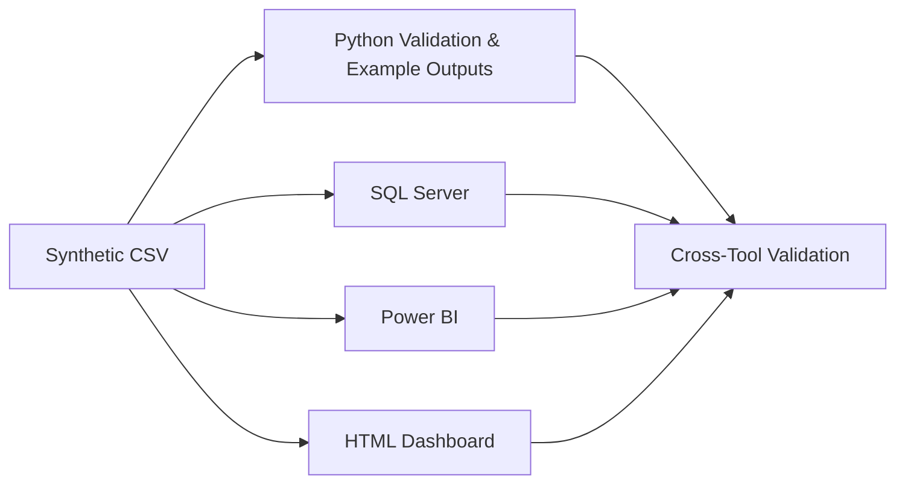

# Architecture

## Design principle
`data/sample_pharmacy_products.csv` is the public **Clean Master Dataset**. Every analytical layer uses the same field definitions and KPI rules so differences are attributable to tool implementation rather than changing source logic.

## Security boundary
The portfolio repository is fully decoupled from any production source. No live connectors, credentials, internal hosts, customer records, employee records, prescription records, or proprietary row-level data are required.
