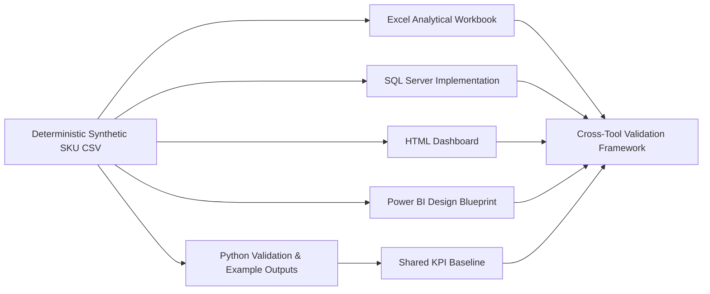

# Architecture

## Design principle

`data/sample_pharmacy_products.csv` is the public **Clean Master Dataset**.

The analytical grain is one synthetic SKU per row. The same public definitions are used to make tool differences visible rather than silently changing business logic between implementations.

## Implementation boundaries

- **Python** — executable generation, validation and retained-output logic.
- **Excel** — checked-in workbook artifact.
- **SQL Server** — T-SQL implementation and example exported output workbook.
- **HTML** — implemented interactive dashboard.
- **Power BI** — design blueprint only.

Cross-tool runtime reconciliation remains a framework until all comparison cells are supported by fresh execution evidence.

## Security boundary

No live production connector, credential, internal host, customer record, employee record, prescription record or proprietary row-level dataset is required.
